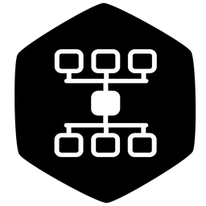
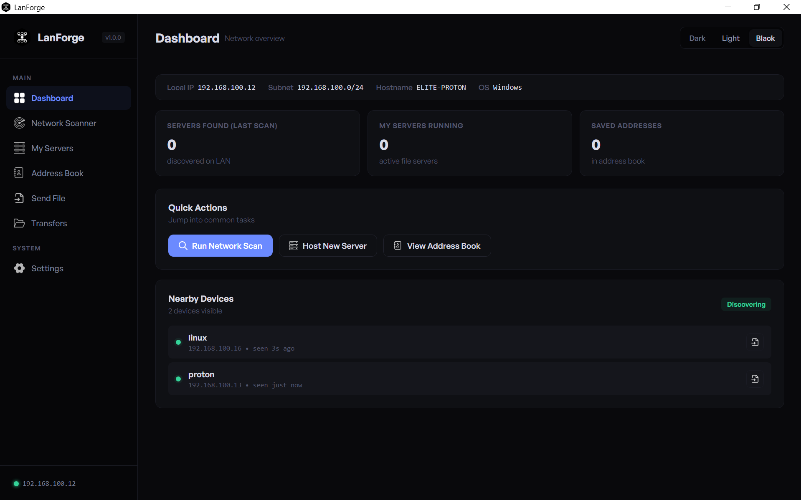
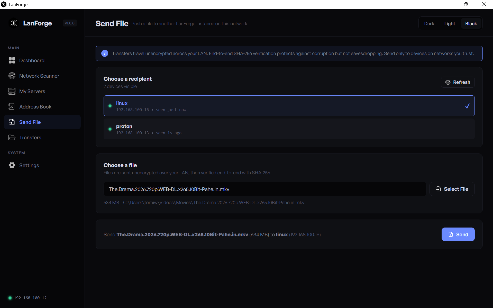
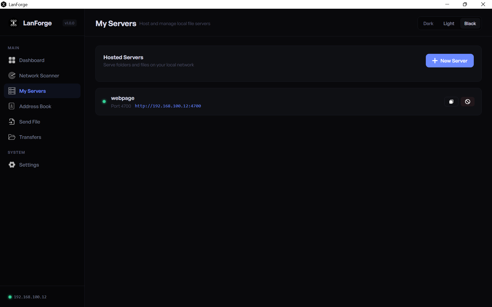

<p align="center">
  
</p>

<h1 align="center">LanForge</h1>

<p align="center">
  A local network toolkit for Windows and Linux.<br>
  Find web servers on your network, share folders over HTTP, and send files
  between computers. No account, no cloud, no internet connection needed.
</p>

<p align="center">
  <a href="https://github.com/tomiwa-adesanya/lanforge/releases/latest"></a>
  
  
</p>

---

## What is LanForge?

LanForge is a desktop app for the network you are already on: your home, office
or classroom Wi-Fi. It does three things.

- **Scan** the network for web servers and tell you what each one is.
- **Host** any folder as a small web server that other devices can open in a
  browser, with an optional password.
- **Send** files straight to other computers running LanForge, with every file
  checked end to end so you know it arrived intact.

Everything stays on your local network. LanForge never talks to a server of its
own.


*Dashboard: scan results, running servers, saved addresses and nearby devices at a glance*

---

## Features

**Network Scanner**

- **Quick Scan:** checks every address on your network against 42 common web
  ports.
- **LanForge Scan:** finds folders shared by other LanForge users (ports
  4700-4750). By default it only checks devices that are already visible, which
  is fast. Turn on Aggressive LanForge Scan in Settings to sweep the whole
  network and find devices that are not announcing themselves.
- **Custom Scan:** choose the address range, port range, timeout and number of
  threads.
- Each result shows the address, protocol, status code, page title, hostname
  and the server type it recognises: Apache, Nginx, XAMPP, IIS, LiteSpeed,
  Caddy, Tomcat, Node.js, Python, PHP, Gunicorn, Lighttpd, OpenResty or
  LanForge.
- Filter results by server type.
- Optional auto-rescan every 15 seconds, 30 seconds, 1 minute, 5 minutes or 15
  minutes, after your first manual scan.

**My Servers**

- Share any folder on your computer as a web server on a port from 4700 to 4750.
- Anyone on the same network opens the link in their browser to browse and
  download files. No app needed on their side.
- Optional password. Visitors sign in once and stay signed in for 24 hours.
- Videos stream with full seeking, so a browser can jump to any point in a
  large file.
- Run several servers at once, each with its own label.
- The share link updates on its own if your network changes.

**Send files between computers**

- Nearby computers running LanForge appear on the dashboard automatically.
- Pick a device, pick a file, and send. The other person sees an offer and
  chooses to accept or decline. An offer they ignore expires after 60 seconds.
- Every file is checked with SHA-256 when it arrives. A file that does not
  match exactly is never saved as complete.
- Pause and resume: an interrupted transfer continues from where it stopped
  instead of starting again.
- Choose where received files go, cap the largest file you will accept (default
  5 GB, up to 50 GB), and choose how long unfinished downloads are kept for
  resuming.
- A Transfers page shows what is in progress, what is paused, and your last 50
  completed, declined or cancelled transfers.
- Receiving is off by default. Turn on Receive Mode in Settings when you want
  this computer to be visible and able to receive.

**Runs in the background**

- Closing the window hides LanForge to the system tray. Discovery, receiving
  and your shared folders keep running.
- Right-click the tray icon and use **Send file to** to send a file to a nearby
  device without opening the window.
- A notification appears when someone sends you a file. Click it to bring
  LanForge back.
- Optional: start LanForge automatically when you log in, straight to the tray.
- Opening LanForge a second time shows the copy that is already running.
- Quit completely with **Exit** in the tray menu.

**Address Book**

- Save the addresses you recognise with a name, and scan results show that name.
- Export your address book to a file for backup, and import it later.

**Appearance**

- Three themes: Dark, Light and Pitch Black.

**Keyboard shortcuts**

| Action          | Shortcut |
| --------------- | -------- |
| Dashboard       | Ctrl+1   |
| Network Scanner | Ctrl+2   |
| My Servers      | Ctrl+3   |
| Address Book    | Ctrl+4   |
| Send File       | Ctrl+5   |
| Transfers       | Ctrl+6   |
| Settings        | Ctrl+7   |
| Hide to tray    | Ctrl+W   |
| Close a dialog  | Escape   |

---

## Screenshots


*Send File: pick a nearby device and a file*


*My Servers: a shared folder with its link for other devices*

---

## System requirements

**Windows**

- Windows 10 or Windows 11, 64-bit (x64)
- Microsoft Edge WebView2 Runtime. It is already included with Windows 11 and
  current Windows 10. If the window does not open, install it from
  [Microsoft](https://developer.microsoft.com/en-us/microsoft-edge/webview2/).

**Linux**

- A 64-bit Debian or Ubuntu based distribution
- GTK 3 and WebKitGTK. The `.deb` package installs these for you.

---

## Download and install

Download the latest version from the
[Releases](https://github.com/tomiwa-adesanya/lanforge/releases/latest) page.

### Windows

| File                                             | What it is                                                                          |
| ------------------------------------------------ | ----------------------------------------------------------------------------------- |
| `lanforge-v<version>-windows-x64-setup.exe`      | Installer (recommended). Adds a Start menu shortcut and, if you choose, a desktop icon. |
| `lanforge-v<version>-windows-x64-standalone.zip` | Portable. Extract anywhere and run `LanForge.exe`.                                  |

LanForge is not code signed yet, so Windows SmartScreen may warn the first time
you run it. Choose **More info**, then **Run anyway**.

### Linux

| File                                              | What it is                                                                 |
| ------------------------------------------------- | -------------------------------------------------------------------------- |
| `lanforge_<version>_amd64.deb`                    | Debian and Ubuntu package (recommended). Adds LanForge to your applications menu and installs everything it needs. |
| `lanforge-v<version>-linux-x64-standalone.tar.xz` | Portable. Extract and run the `LanForge` binary.                           |

Install the `.deb` with:

```
sudo apt install ./lanforge_<version>_amd64.deb
```

The portable Linux binary needs these system packages, which the `.deb`
would otherwise install for you:

```
sudo apt install python3-gi python3-gi-cairo gir1.2-gtk-3.0 gir1.2-webkit2-4.1 gir1.2-ayatanaappindicator3-0.1 zenity
```

On older distributions, use `gir1.2-webkit2-4.0` in place of `gir1.2-webkit2-4.1`.

### Verify your download

Every release includes a `SHA256SUMS.txt` file. To check a download on Windows:

```
Get-FileHash .\lanforge-v<version>-windows-x64-setup.exe -Algorithm SHA256
```

On Linux:

```
sha256sum -c SHA256SUMS.txt --ignore-missing
```

The hash must match the line for that file in `SHA256SUMS.txt`. Windows shows
it in capital letters; that is the same hash.

---

## Getting started

**Share a folder**

1. Open **My Servers** and choose **New Server**.
2. Pick a folder, a port between 4700 and 4750, and optionally a password.
3. Give the link shown to anyone on the same network. They open it in a browser.

**Send a file**

1. On both computers, open **Settings** and turn on **Receive Mode**. Set a
   device name under **Alias** so the other person recognises you.
2. On the sending computer, open **Send File**, choose the other computer and a
   file, then **Send**.
3. The receiving computer shows the offer. Accept it within 60 seconds.

Received files go to `Downloads/LanForge` in your home folder unless you choose
another folder in Settings.

**Start hidden at login**

Turn on **Start at login (background)** in Settings. You can also start
LanForge hidden in the tray yourself by launching it with `--background`.

---

## Network and firewall

LanForge only uses your local network. It listens on:

| Port          | Protocol | Used for                          |
| ------------- | -------- | --------------------------------- |
| 4751          | UDP      | Finding nearby LanForge devices   |
| 4752          | TCP      | Receiving files                   |
| 4700 to 4750  | TCP      | Folders you share in My Servers   |

If your firewall asks, allow LanForge on **private** networks. If you block it,
scanning still works, but other devices cannot see you, send you files or open
your shared folders.

All devices must be on the same network. Many public and guest Wi-Fi networks
block devices from reaching each other, and LanForge cannot work across that.

---

## Your data

LanForge stores nothing online. Your settings, address book and device name
are kept in a single folder on your computer:

| OS      | Location                  |
| ------- | ------------------------- |
| Windows | `%APPDATA%\LanForge`      |
| Linux   | `~/.config/LanForge`      |

To back up, copy that folder. To reset LanForge, delete it.

---

## Changelog

### v1.0.0 (2026-09-22): Initial public release

First public release of LanForge: network scanner, folder sharing, file transfer
between computers, system tray and background mode.

---

## Uninstalling

**Windows (installer):** Settings > Apps, or Control Panel > Programs. If you
turned on Start at login, turn it off in LanForge first. Your data folder is not
removed; delete it yourself for a clean removal.

**Windows (portable):** turn off Start at login in LanForge if you used it, then
delete the extracted folder.

**Linux (.deb):**

```
sudo apt remove lanforge
```

**Linux (portable):** turn off Start at login in LanForge if you used it, then
delete the extracted files.

---

## Known limitations

- **Not encrypted.** File transfers and shared folders use plain HTTP. The
  SHA-256 check protects files against damage in transit, not against someone
  watching the network. Use LanForge on networks you trust.
- The scanner covers the network your computer is on (the last number of the
  address, 1 to 254). It does not scan other subnets.
- Shared folders are read-only. Visitors can browse, download and stream, but
  cannot upload.
- Send File sends one file at a time.
- On Linux, the tray icon needs a desktop with tray support. Ubuntu has it by
  default. On desktops without it, closing the window quits LanForge instead of
  hiding it.
- Transfer speed is limited by your network. Wi-Fi is usually much slower than
  a wired connection.

---

## Support

Found a bug or have an idea? Open an issue on the
[Issues](https://github.com/tomiwa-adesanya/lanforge/issues) page. For bugs,
include your LanForge version (shown in the sidebar and in Settings > About) and
your operating system.

---

## License

LanForge is proprietary software. All rights reserved. See [LICENSE](LICENSE)
for details.
